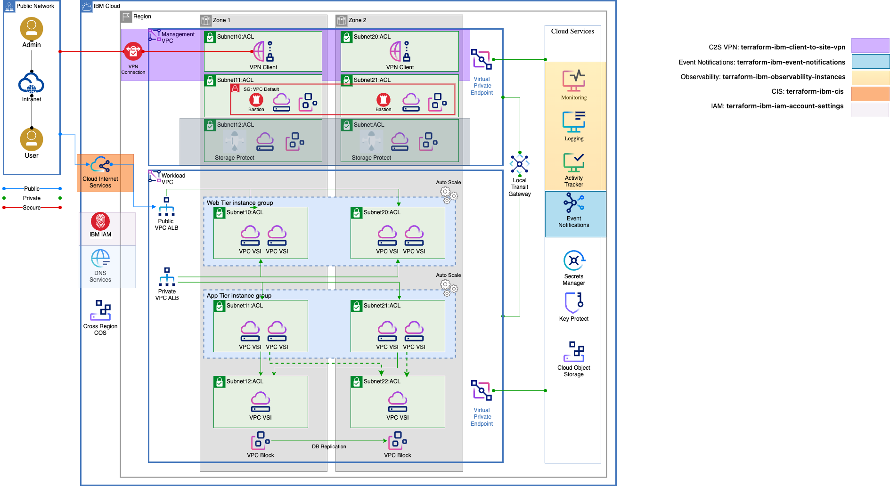

<!-- Update this title with a descriptive name. Use sentence case. -->
# Web app Multi-Zone Resiliency Deployable Architecture

<!--
Update status and "latest release" badges:
  1. For the status options, see https://terraform-ibm-modules.github.io/documentation/#/badge-status
  2. Update the "latest release" badge to point to the correct module's repo. Replace "terraform-ibm-module-template" in two places.
-->
[-red)](https://terraform-ibm-modules.github.io/documentation/#/badge-status)
[](https://github.com/terraform-ibm-modules/terraform-ibm-web-app-mzr-da/releases/latest)
[](https://github.com/pre-commit/pre-commit)
[](https://renovatebot.com/)
[](https://github.com/semantic-release/semantic-release)

<!-- Add a description of module(s) in this repo -->
The web app multi-zone resiliency pattern provides a solution design for a 3-tier web architecture deployment that meets high availability requirements for enterprise workloads. It uses cloud platform capabilities to deploy resilient applications on Virtual Servers for VPC.


<!-- The following content is automatically populated by the pre-commit hook -->
<!-- BEGIN OVERVIEW HOOK -->
## Overview
* [terraform-ibm-web-app-mzr-da](#terraform-ibm-web-app-mzr-da)
* [Contributing](#contributing)
<!-- END OVERVIEW HOOK -->


<!--
If this repo contains any reference architectures, uncomment the heading below and link to them.
(Usually in the `/reference-architectures` directory.)
See "Reference architecture" in the public documentation at
https://terraform-ibm-modules.github.io/documentation/#/implementation-guidelines?id=reference-architecture
-->
<!-- ## Reference architectures -->


<!-- Replace this heading with the name of the root level module (the repo name) -->
## terraform-ibm-web-app-mzr-da



### Usage

```hcl

module "vpc-vsi-multizone" {
  source                        = "terraform-ibm-modules/vpc-vsi-multizone/ibm"
  region                        = var.region
  prefix                        = var.prefix
  ssh_key                       = var.ssh_key
  ssh_private_key               = var.ssh_private_key   <!-- pragma: allowlist secret -->
}

```

#### Sample application

This deployable architecture has a built-in sample application if you wish you deploy with the infrastructure and services.  If you wish to provision it with the pattern, it will install and setup the following:

* Web tier: NGINX Web server and proxy
* App tier: Sample Nodejs application that pulls data from the backend database
* Data tier: Highly-available Postgresql database

To enable the sample application, set the variable `sample_application` to the value `true`.  After the application provisions, you can issue requests to it by doing the following:

1. Determine the FQDN of the web-tier load-balancer.  This can be found on the console under [Load Balancers for VPC](https://cloud.ibm.com/vpc-ext/network/loadBalancers)
2. If you provisioned secrets manager with the pattern, you will be using `https` to access the sample application and can access it via `https://[FQDN of Load balancer]/students`
3. If you did not provision secrets manager with the pattern, you will use `http` to access the sample application: `http://[FQDN of Load balancer]:443/students`

### Required IAM access policies

<!-- PERMISSIONS REQUIRED TO RUN MODULE
If this module requires permissions, uncomment the following block and update
the sample permissions, following the format.
Replace the sample Account and IBM Cloud service names and roles with the
information in the console at
Manage > Access (IAM) > Access groups > Access policies.
-->

You need the following permissions to run this deployable architecture.

- IAM services
    - **VPC Infrastructure** services
        - `Editor` platform access
    - **All IAM Account Management services**
        - `Admin` platform access

To attach access management tags to resources in this module, you need the following permissions.

- IAM Services
    - **Tagging** service
        - `Administrator` platform access
        -
<!-- NO PERMISSIONS FOR MODULE
If no permissions are required for the module, uncomment the following
statement instead the previous block.
-->

<!-- No permissions are needed to run this module.-->


<!-- The following content is automatically populated by the pre-commit hook -->
<!-- BEGINNING OF PRE-COMMIT-TERRAFORM DOCS HOOK -->
### Requirements

| Name | Version |
|------|---------|
| <a name="requirement_terraform"></a> [terraform](#requirement\_terraform) | >= 1.3.0 |
| <a name="requirement_ibm"></a> [ibm](#requirement\_ibm) | 1.87.3 |
| <a name="requirement_null"></a> [null](#requirement\_null) | 3.2.4 |
| <a name="requirement_random"></a> [random](#requirement\_random) | 3.8.1 |

### Modules

| Name | Source | Version |
|------|--------|---------|
| <a name="module_app_tier_autoscale"></a> [app\_tier\_autoscale](#module\_app\_tier\_autoscale) | github.com/terraform-ibm-modules/terraform-ibm-landing-zone-vsi-autoscale | v1.0.12 |
| <a name="module_data_tier_vsi"></a> [data\_tier\_vsi](#module\_data\_tier\_vsi) | terraform-ibm-modules/landing-zone-vsi/ibm | 6.0.0 |
| <a name="module_landing_zone"></a> [landing\_zone](#module\_landing\_zone) | git::https://github.com/terraform-ibm-modules/terraform-ibm-landing-zone.git//patterns/vsi/module | v8.14.19 |
| <a name="module_private_secret_engine"></a> [private\_secret\_engine](#module\_private\_secret\_engine) | terraform-ibm-modules/secrets-manager-private-cert-engine/ibm | 1.12.13 |
| <a name="module_secrets_manager_group"></a> [secrets\_manager\_group](#module\_secrets\_manager\_group) | terraform-ibm-modules/secrets-manager-secret-group/ibm | 1.4.2 |
| <a name="module_secrets_manager_private_certificate"></a> [secrets\_manager\_private\_certificate](#module\_secrets\_manager\_private\_certificate) | terraform-ibm-modules/secrets-manager-private-cert/ibm | 1.10.19 |
| <a name="module_sm_resource_group"></a> [sm\_resource\_group](#module\_sm\_resource\_group) | terraform-ibm-modules/resource-group/ibm | 1.4.7 |
| <a name="module_web_tier_autoscale"></a> [web\_tier\_autoscale](#module\_web\_tier\_autoscale) | github.com/terraform-ibm-modules/terraform-ibm-landing-zone-vsi-autoscale | v1.0.12 |

### Resources

| Name | Type |
|------|------|
| [ibm_iam_authorization_policy.s2s_lb_to_sm](https://registry.terraform.io/providers/IBM-Cloud/ibm/1.87.3/docs/resources/iam_authorization_policy) | resource |
| [ibm_resource_instance.secrets_manager](https://registry.terraform.io/providers/IBM-Cloud/ibm/1.87.3/docs/resources/resource_instance) | resource |
| [null_resource.primary_postgresql_install](https://registry.terraform.io/providers/hashicorp/null/3.2.4/docs/resources/resource) | resource |
| [null_resource.secondary_postgresql_install](https://registry.terraform.io/providers/hashicorp/null/3.2.4/docs/resources/resource) | resource |
| [random_password.password](https://registry.terraform.io/providers/hashicorp/random/3.8.1/docs/resources/password) | resource |
| [ibm_is_image.app_is_image](https://registry.terraform.io/providers/IBM-Cloud/ibm/1.87.3/docs/data-sources/is_image) | data source |
| [ibm_is_image.data_is_image](https://registry.terraform.io/providers/IBM-Cloud/ibm/1.87.3/docs/data-sources/is_image) | data source |
| [ibm_is_image.web_is_image](https://registry.terraform.io/providers/IBM-Cloud/ibm/1.87.3/docs/data-sources/is_image) | data source |

### Inputs

| Name | Description | Type | Default | Required |
|------|-------------|------|---------|:--------:|
| <a name="input_app_application_port"></a> [app\_application\_port](#input\_app\_application\_port) | The instance group the application tier uses when scaling up instances to supply the port for the Load Balancer pool member. | `number` | `3000` | no |
| <a name="input_app_block_storage_volumes"></a> [app\_block\_storage\_volumes](#input\_app\_block\_storage\_volumes) | List describing the block storage volumes that will be attached to each vsi | <pre>list(<br/>    object({<br/>      name              = string<br/>      profile           = string<br/>      capacity          = optional(number)<br/>      iops              = optional(number)<br/>      encryption_key    = optional(string)<br/>      resource_group_id = optional(string)<br/>    })<br/>  )</pre> | `[]` | no |
| <a name="input_app_boot_volume_encryption_key_suffix"></a> [app\_boot\_volume\_encryption\_key\_suffix](#input\_app\_boot\_volume\_encryption\_key\_suffix) | App tier boot volume encryption key suffix | `string` | `"vsi-volume-key"` | no |
| <a name="input_app_group_managers"></a> [app\_group\_managers](#input\_app\_group\_managers) | Instance group manager to add to the instance group | <pre>list(<br/>    object({<br/>      name                 = string<br/>      aggregation_window   = optional(number)<br/>      cooldown             = optional(number)<br/>      enable_manager       = optional(bool)<br/>      manager_type         = string<br/>      max_membership_count = optional(number)<br/>      min_membership_count = optional(number)<br/>      actions = optional(<br/>        list(<br/>          object({<br/>            name                 = string<br/>            cron_spec            = optional(string)<br/>            membership_count     = optional(number)<br/>            max_membership_count = optional(number)<br/>            min_membership_count = optional(number)<br/>            run_at               = optional(string)<br/>          })<br/>        )<br/>      )<br/>      policies = optional(<br/>        list(<br/>          object({<br/>            name         = string<br/>            metric_type  = string<br/>            metric_value = number<br/>            policy_type  = string<br/>          })<br/>        )<br/>      )<br/>    })<br/>  )</pre> | <pre>[<br/>  {<br/>    "aggregation_window": 120,<br/>    "cooldown": 300,<br/>    "enable_manager": true,<br/>    "manager_type": "autoscale",<br/>    "max_membership_count": 4,<br/>    "min_membership_count": 1,<br/>    "name": "app",<br/>    "policies": [<br/>      {<br/>        "metric_type": "cpu",<br/>        "metric_value": 70,<br/>        "name": "app-policy",<br/>        "policy_type": "target"<br/>      }<br/>    ]<br/>  }<br/>]</pre> | no |
| <a name="input_app_instance_count"></a> [app\_instance\_count](#input\_app\_instance\_count) | The number of instances to create in the instance group. | `number` | `1` | no |
| <a name="input_app_load_balancers"></a> [app\_load\_balancers](#input\_app\_load\_balancers) | Load balancers to add to VSI | <pre>list(<br/>    object({<br/>      name                    = string<br/>      type                    = string<br/>      listener_port           = number<br/>      listener_protocol       = string<br/>      connection_limit        = number<br/>      idle_connection_timeout = optional(number)<br/>      algorithm               = string<br/>      protocol                = string<br/>      health_delay            = number<br/>      health_retries          = number<br/>      health_timeout          = number<br/>      health_type             = string<br/>      pool_member_port        = string<br/>      profile                 = optional(string)<br/>      dns = optional(<br/>        object({<br/>          instance_crn = string<br/>          zone_id      = string<br/>        })<br/>      )<br/>      security_group = optional(<br/>        object({<br/>          name = string<br/>          rules = list(<br/>            object({<br/>              name      = string<br/>              direction = string<br/>              source    = string<br/>              tcp = optional(<br/>                object({<br/>                  port_max = number<br/>                  port_min = number<br/>                })<br/>              )<br/>              udp = optional(<br/>                object({<br/>                  port_max = number<br/>                  port_min = number<br/>                })<br/>              )<br/>              icmp = optional(<br/>                object({<br/>                  type = number<br/>                  code = number<br/>                })<br/>              )<br/>            })<br/>          )<br/>        })<br/>      )<br/>    })<br/>  )</pre> | <pre>[<br/>  {<br/>    "algorithm": "round_robin",<br/>    "connection_limit": 10,<br/>    "health_delay": 60,<br/>    "health_retries": 5,<br/>    "health_timeout": 30,<br/>    "health_type": "tcp",<br/>    "listener_port": 3000,<br/>    "listener_protocol": "tcp",<br/>    "name": "app-lb",<br/>    "pool_member_port": 3000,<br/>    "protocol": "tcp",<br/>    "security_group": {<br/>      "name": "app-lb-sg",<br/>      "rules": [<br/>        {<br/>          "direction": "inbound",<br/>          "name": "allow-vpc-inbound",<br/>          "source": "10.0.0.0/8"<br/>        },<br/>        {<br/>          "direction": "outbound",<br/>          "name": "allow-vpc-outbound",<br/>          "source": "10.0.0.0/8"<br/>        }<br/>      ]<br/>    },<br/>    "type": "private"<br/>  }<br/>]</pre> | no |
| <a name="input_app_machine_type"></a> [app\_machine\_type](#input\_app\_machine\_type) | Application tier machine type to use | `string` | `"cx2-2x4"` | no |
| <a name="input_app_os_profile"></a> [app\_os\_profile](#input\_app\_os\_profile) | Application tier machine type to use | `string` | `"ibm-centos-stream-9-amd64-5"` | no |
| <a name="input_app_security_group"></a> [app\_security\_group](#input\_app\_security\_group) | The security group surrounding the application tier VSIs | <pre>object({<br/>    name                         = string<br/>    add_ibm_cloud_internal_rules = optional(bool, false)<br/>    rules = list(<br/>      object({<br/>        name      = string<br/>        direction = string<br/>        source    = string<br/>        tcp = optional(<br/>          object({<br/>            port_max = number<br/>            port_min = number<br/>          })<br/>        )<br/>        udp = optional(<br/>          object({<br/>            port_max = number<br/>            port_min = number<br/>          })<br/>        )<br/>        icmp = optional(<br/>          object({<br/>            type = number<br/>            code = number<br/>          })<br/>        )<br/>      })<br/>    )<br/>  })</pre> | <pre>{<br/>  "name": "app-sg",<br/>  "rules": [<br/>    {<br/>      "direction": "inbound",<br/>      "name": "allow-vpc-inbound",<br/>      "source": "10.0.0.0/8"<br/>    },<br/>    {<br/>      "direction": "inbound",<br/>      "name": "allow-ibm-inbound",<br/>      "source": "161.26.0.0/16"<br/>    },<br/>    {<br/>      "direction": "outbound",<br/>      "name": "allow-vpc-outbound",<br/>      "source": "10.0.0.0/8"<br/>    },<br/>    {<br/>      "direction": "outbound",<br/>      "name": "allow-ibm-outbound",<br/>      "source": "161.26.0.0/16"<br/>    }<br/>  ]<br/>}</pre> | no |
| <a name="input_cert_common_name"></a> [cert\_common\_name](#input\_cert\_common\_name) | A fully qualified domain name or host domain name for the certificate to be created. | `string` | `"test.webapp.com"` | no |
| <a name="input_certificate_template_name"></a> [certificate\_template\_name](#input\_certificate\_template\_name) | The name of the Certificate Template to create for a private\_cert secret engine. When `var.existing_sm_instance_guid` is `true`, then it has to be the existing template name that exists in the private cert engine. | `string` | `"my-template"` | no |
| <a name="input_create_s2s_lb_to_sm"></a> [create\_s2s\_lb\_to\_sm](#input\_create\_s2s\_lb\_to\_sm) | Create a service-to-service authorization between VPC LB and Secrets Manager. | `bool` | `true` | no |
| <a name="input_data_block_storage_volumes"></a> [data\_block\_storage\_volumes](#input\_data\_block\_storage\_volumes) | The data block storage volume to attach to the data VSIs | <pre>list(<br/>    object({<br/>      name              = string<br/>      profile           = string<br/>      capacity          = optional(number)<br/>      iops              = optional(number)<br/>      encryption_key    = optional(string)<br/>      resource_group_id = optional(string)<br/>    })<br/>  )</pre> | <pre>[<br/>  {<br/>    "capacity": 50,<br/>    "name": "data",<br/>    "profile": "general-purpose"<br/>  }<br/>]</pre> | no |
| <a name="input_data_boot_volume_encryption_key_suffix"></a> [data\_boot\_volume\_encryption\_key\_suffix](#input\_data\_boot\_volume\_encryption\_key\_suffix) | Data tier boot volume encryption key suffix | `string` | `"vsi-volume-key"` | no |
| <a name="input_data_machine_type"></a> [data\_machine\_type](#input\_data\_machine\_type) | Application tier machine type to use | `string` | `"cx2-2x4"` | no |
| <a name="input_data_os_profile"></a> [data\_os\_profile](#input\_data\_os\_profile) | Application tier os profile to use | `string` | `"ibm-centos-stream-9-amd64-5"` | no |
| <a name="input_data_security_group"></a> [data\_security\_group](#input\_data\_security\_group) | The security group surrounding the data tier VSIs | <pre>object({<br/>    name                         = string<br/>    add_ibm_cloud_internal_rules = optional(bool, false)<br/>    rules = list(<br/>      object({<br/>        name      = string<br/>        direction = string<br/>        source    = string<br/>        tcp = optional(<br/>          object({<br/>            port_max = number<br/>            port_min = number<br/>          })<br/>        )<br/>        udp = optional(<br/>          object({<br/>            port_max = number<br/>            port_min = number<br/>          })<br/>        )<br/>        icmp = optional(<br/>          object({<br/>            type = number<br/>            code = number<br/>          })<br/>        )<br/>      })<br/>    )<br/>  })</pre> | <pre>{<br/>  "name": "data-sg",<br/>  "rules": [<br/>    {<br/>      "direction": "inbound",<br/>      "name": "allow-vpc-inbound",<br/>      "source": "10.0.0.0/8"<br/>    },<br/>    {<br/>      "direction": "inbound",<br/>      "name": "allow-ibm-inbound",<br/>      "source": "161.26.0.0/16"<br/>    },<br/>    {<br/>      "direction": "outbound",<br/>      "name": "allow-vpc-outbound",<br/>      "source": "10.0.0.0/8"<br/>    },<br/>    {<br/>      "direction": "outbound",<br/>      "name": "allow-ibm-outbound",<br/>      "source": "161.26.0.0/16"<br/>    }<br/>  ]<br/>}</pre> | no |
| <a name="input_data_vsi_per_subnet"></a> [data\_vsi\_per\_subnet](#input\_data\_vsi\_per\_subnet) | Application tier number of vsi's per subnet | `number` | `1` | no |
| <a name="input_existing_sm_instance_guid"></a> [existing\_sm\_instance\_guid](#input\_existing\_sm\_instance\_guid) | An existing Secrets Manager GUID. The existing Secret Manager instance must have private certificate engine configured. If not provided an new instance will be provisioned. | `string` | `null` | no |
| <a name="input_existing_sm_instance_region"></a> [existing\_sm\_instance\_region](#input\_existing\_sm\_instance\_region) | Required if value is passed into `var.existing_sm_instance_guid`. | `string` | `null` | no |
| <a name="input_ibmcloud_api_key"></a> [ibmcloud\_api\_key](#input\_ibmcloud\_api\_key) | The IBM Cloud platform API key needed to deploy IAM enabled resources. | `string` | n/a | yes |
| <a name="input_intermediate_ca_name"></a> [intermediate\_ca\_name](#input\_intermediate\_ca\_name) | The name of the Intermediate CA to create for a private\_cert secret engine. Only used when `var.existing_sm_instance_guid` is `false`. | `string` | `"intermediate-ca"` | no |
| <a name="input_prefix"></a> [prefix](#input\_prefix) | A unique identifier for resources. Must begin with a lowercase letter and end with a lowerccase letter or number. This prefix will be prepended to any resources provisioned by this template. Prefixes must be 16 or fewer characters. | `string` | `"lab"` | no |
| <a name="input_region"></a> [region](#input\_region) | IBM Cloud region where the resources will be created. | `string` | n/a | yes |
| <a name="input_resource_tags"></a> [resource\_tags](#input\_resource\_tags) | Optional list of tags to be added to the Key Protect instance. Only used if 'create\_key\_protect\_instance' is true. | `list(string)` | `[]` | no |
| <a name="input_root_ca_common_name"></a> [root\_ca\_common\_name](#input\_root\_ca\_common\_name) | A fully qualified domain name or host domain name for the certificate to be created. | `string` | `"example.com"` | no |
| <a name="input_root_ca_name"></a> [root\_ca\_name](#input\_root\_ca\_name) | The name of the Root CA to create for a private\_cert secret engine. Only used when `var.existing_sm_instance_guid` is `false`. | `string` | `"root-ca"` | no |
| <a name="input_sample_application"></a> [sample\_application](#input\_sample\_application) | Apply the sample web application to the pattern. | `bool` | `false` | no |
| <a name="input_sm_instance_rg_existing"></a> [sm\_instance\_rg\_existing](#input\_sm\_instance\_rg\_existing) | Resource group exists in your account already. If set to `true`, you will need to set the variable sm\_instance\_rg\_name | `bool` | `false` | no |
| <a name="input_sm_instance_rg_name"></a> [sm\_instance\_rg\_name](#input\_sm\_instance\_rg\_name) | Resource group to provision the secrets manager instance.  If no resource group name is defined, it will try to use the service resource group otherwise a random from the landing zone | `string` | `null` | no |
| <a name="input_sm_service_plan"></a> [sm\_service\_plan](#input\_sm\_service\_plan) | The service/pricing plan to use when provisioning a new Secrets Manager instance. Allowed values: `standard` and `trial`. | `string` | `"standard"` | no |
| <a name="input_ssh_key"></a> [ssh\_key](#input\_ssh\_key) | Public SSH Key for VSI creation. Must be a valid SSH key that does not already exist in the deployment region. | `string` | n/a | yes |
| <a name="input_ssh_private_key"></a> [ssh\_private\_key](#input\_ssh\_private\_key) | Private SSH key (RSA format) that is paired with the public ssh key. | `string` | n/a | yes |
| <a name="input_use_legacy_network_interface"></a> [use\_legacy\_network\_interface](#input\_use\_legacy\_network\_interface) | Set this to true to use legacy network interface for the created instances. | `bool` | `false` | no |
| <a name="input_use_sm"></a> [use\_sm](#input\_use\_sm) | Whether to use Secrets Manager to generate certificates. | `bool` | `true` | no |
| <a name="input_web_application_port"></a> [web\_application\_port](#input\_web\_application\_port) | The instance group the web tier uses when scaling up instances to supply the port for the Load Balancer pool member. | `number` | `80` | no |
| <a name="input_web_block_storage_volumes"></a> [web\_block\_storage\_volumes](#input\_web\_block\_storage\_volumes) | List describing the block storage volumes that will be attached to each vsi | <pre>list(<br/>    object({<br/>      name              = string<br/>      profile           = string<br/>      capacity          = optional(number)<br/>      iops              = optional(number)<br/>      encryption_key    = optional(string)<br/>      resource_group_id = optional(string)<br/>    })<br/>  )</pre> | `[]` | no |
| <a name="input_web_boot_volume_encryption_key_suffix"></a> [web\_boot\_volume\_encryption\_key\_suffix](#input\_web\_boot\_volume\_encryption\_key\_suffix) | Web tier boot volume encryption key suffix | `string` | `"vsi-volume-key"` | no |
| <a name="input_web_group_managers"></a> [web\_group\_managers](#input\_web\_group\_managers) | Instance group manager to add to the instance group | <pre>list(<br/>    object({<br/>      name                 = string<br/>      aggregation_window   = optional(number)<br/>      cooldown             = optional(number)<br/>      enable_manager       = optional(bool)<br/>      manager_type         = string<br/>      max_membership_count = optional(number)<br/>      min_membership_count = optional(number)<br/>      actions = optional(<br/>        list(<br/>          object({<br/>            name                 = string<br/>            cron_spec            = optional(string)<br/>            membership_count     = optional(number)<br/>            max_membership_count = optional(number)<br/>            min_membership_count = optional(number)<br/>            run_at               = optional(string)<br/>          })<br/>        )<br/>      )<br/>      policies = optional(<br/>        list(<br/>          object({<br/>            name         = string<br/>            metric_type  = string<br/>            metric_value = number<br/>            policy_type  = string<br/>          })<br/>        )<br/>      )<br/>    })<br/>  )</pre> | <pre>[<br/>  {<br/>    "aggregation_window": 120,<br/>    "cooldown": 300,<br/>    "enable_manager": true,<br/>    "manager_type": "autoscale",<br/>    "max_membership_count": 4,<br/>    "min_membership_count": 1,<br/>    "name": "web",<br/>    "policies": [<br/>      {<br/>        "metric_type": "cpu",<br/>        "metric_value": 70,<br/>        "name": "web-policy",<br/>        "policy_type": "target"<br/>      }<br/>    ]<br/>  }<br/>]</pre> | no |
| <a name="input_web_instance_count"></a> [web\_instance\_count](#input\_web\_instance\_count) | The number of instances to create in the instance group. | `number` | `1` | no |
| <a name="input_web_load_balancers"></a> [web\_load\_balancers](#input\_web\_load\_balancers) | Load balancers to add to VSI | <pre>list(<br/>    object({<br/>      name                    = string<br/>      type                    = string<br/>      listener_port           = number<br/>      listener_protocol       = string<br/>      connection_limit        = number<br/>      idle_connection_timeout = optional(number)<br/>      algorithm               = string<br/>      protocol                = string<br/>      health_delay            = number<br/>      health_retries          = number<br/>      health_timeout          = number<br/>      health_type             = string<br/>      pool_member_port        = string<br/>      profile                 = optional(string)<br/>      dns = optional(<br/>        object({<br/>          instance_crn = string<br/>          zone_id      = string<br/>        })<br/>      )<br/>      security_group = optional(<br/>        object({<br/>          name = string<br/>          rules = list(<br/>            object({<br/>              name      = string<br/>              direction = string<br/>              source    = string<br/>              tcp = optional(<br/>                object({<br/>                  port_max = number<br/>                  port_min = number<br/>                })<br/>              )<br/>              udp = optional(<br/>                object({<br/>                  port_max = number<br/>                  port_min = number<br/>                })<br/>              )<br/>              icmp = optional(<br/>                object({<br/>                  type = number<br/>                  code = number<br/>                })<br/>              )<br/>            })<br/>          )<br/>        })<br/>      )<br/>    })<br/>  )</pre> | <pre>[<br/>  {<br/>    "algorithm": "round_robin",<br/>    "connection_limit": 10,<br/>    "health_delay": 60,<br/>    "health_retries": 5,<br/>    "health_timeout": 30,<br/>    "health_type": "tcp",<br/>    "listener_port": 443,<br/>    "listener_protocol": "http",<br/>    "name": "web-lb",<br/>    "pool_member_port": 80,<br/>    "protocol": "http",<br/>    "security_group": {<br/>      "name": "web-lb-sg",<br/>      "rules": [<br/>        {<br/>          "direction": "inbound",<br/>          "name": "allow-all-inbound",<br/>          "source": "0.0.0.0/0",<br/>          "tcp": {<br/>            "port_max": 443,<br/>            "port_min": 443<br/>          }<br/>        },<br/>        {<br/>          "direction": "outbound",<br/>          "name": "allow-vpc-outbound",<br/>          "source": "10.0.0.0/8"<br/>        }<br/>      ]<br/>    },<br/>    "type": "public"<br/>  }<br/>]</pre> | no |
| <a name="input_web_machine_type"></a> [web\_machine\_type](#input\_web\_machine\_type) | Web tier machine type to use | `string` | `"cx2-2x4"` | no |
| <a name="input_web_os_profile"></a> [web\_os\_profile](#input\_web\_os\_profile) | Web tier os name to use | `string` | `"ibm-centos-stream-9-amd64-5"` | no |
| <a name="input_web_security_group"></a> [web\_security\_group](#input\_web\_security\_group) | The security group surrounding the web tier VSIs | <pre>object({<br/>    name                         = string<br/>    add_ibm_cloud_internal_rules = optional(bool, false)<br/>    rules = list(<br/>      object({<br/>        name      = string<br/>        direction = string<br/>        source    = string<br/>        tcp = optional(<br/>          object({<br/>            port_max = number<br/>            port_min = number<br/>          })<br/>        )<br/>        udp = optional(<br/>          object({<br/>            port_max = number<br/>            port_min = number<br/>          })<br/>        )<br/>        icmp = optional(<br/>          object({<br/>            type = number<br/>            code = number<br/>          })<br/>        )<br/>      })<br/>    )<br/>  })</pre> | <pre>{<br/>  "name": "web-sg",<br/>  "rules": [<br/>    {<br/>      "direction": "inbound",<br/>      "name": "allow-vpc-inbound",<br/>      "source": "10.0.0.0/8"<br/>    },<br/>    {<br/>      "direction": "inbound",<br/>      "name": "allow-ibm-inbound",<br/>      "source": "161.26.0.0/16"<br/>    },<br/>    {<br/>      "direction": "outbound",<br/>      "name": "allow-vpc-outbound",<br/>      "source": "10.0.0.0/8"<br/>    },<br/>    {<br/>      "direction": "outbound",<br/>      "name": "allow-ibm-outbound",<br/>      "source": "161.26.0.0/16"<br/>    }<br/>  ]<br/>}</pre> | no |

### Outputs

| Name | Description |
|------|-------------|
| <a name="output_landing_zone"></a> [landing\_zone](#output\_landing\_zone) | Landing zone configuration |
| <a name="output_vpc_data"></a> [vpc\_data](#output\_vpc\_data) | Landing zone vpc data |
<!-- END OF PRE-COMMIT-TERRAFORM DOCS HOOK -->

<!-- Leave this section as is so that your module has a link to local development environment set-up steps for contributors to follow -->
## Contributing

You can report issues and request features for this module in GitHub issues in the module repo. See [Report an issue or request a feature](https://github.com/terraform-ibm-modules/.github/blob/main/.github/SUPPORT.md).

To set up your local development environment, see [Local development setup](https://terraform-ibm-modules.github.io/documentation/#/local-dev-setup) in the project documentation.
